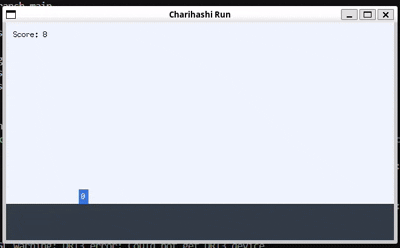

# ebitengine-jumpaction

Go + Ebitengine で作った、最低限の「チャリ走風」2D 横スクロールランゲームです。  
プレイヤー（`@`）は自動で進んでいるように見え、障害物（`#`）をジャンプで避け続けます。



## 動作環境

### 前提

- Go 1.2x 以降
- Ebitengine (Ebiten)
- ※ここでは **Linux** の依存関係について説明します。

### Linux での依存パッケージ

Ebitengine は内部で GLFW や OpenGL, X11 を利用しているため、  
Linux 上でビルド・実行するには、以下のネイティブライブラリ（開発用パッケージ）が必要になります。

Ubuntu / WSL (Ubuntu) の場合:

```bash
sudo apt update
sudo apt install -y \
  libx11-dev libxrandr-dev libxinerama-dev libxcursor-dev libxi-dev \
  libgl1-mesa-dev libxxf86vm-dev
```

## 依存取得方法
```bash
go mod tidy
```

## 開発用の起動方法
```bash
go run .
```

## ビルド方法
```bash
go build -o chirihash-run .
```

## ビルド後の実行方法
```bash
./chirihash-run
```

## 操作方法
- `Space`: ジャンプ
- `R`: リトライ（ゲームオーバー時）
- `Esc`: 終了

## 画面仕様
- タイトル画面: `Press Space to Start`
- プレイ中画面: スコア表示、地面、プレイヤー `@`、障害物 `#`
- ゲームオーバー画面: `Game Over` / `Press R to Retry`

## 実装メモ
- 画像・音声などの外部アセットは未使用
- 地面と障害物を左へ流して横スクロールを表現
- 当たり判定は単純な矩形判定
